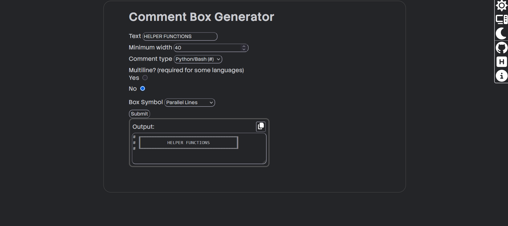
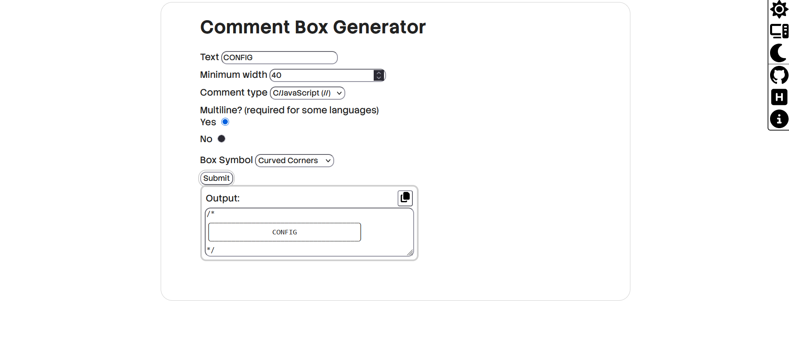

# Comment Box Generator

[](https://visitorbadge.io/status?path=nouxinf%2Fcomment-box-generator)

**Comment Box Generator** is a simple online tool that lets you generate unicode/ASCII comment boxes that look like this:

```python
# ╔════════════════════════════════════╗
# ║          HELPER FUNCTIONS          ║
# ╚════════════════════════════════════╝
```

You can try it out at <a href="https://commentboxgenerator.lemonsite.uk/" target="_blank">commentboxgenerator.lemonsite.uk</a>.

## Screenshots





## How it works

### Folder structure

```
comment-box-generator
├── img/ (readme images)
│   ├── scr1.png
│   └── src2.png
├── src/ (site code)
│   ├── assets/
│   │   ├── fonts/
│   │   │   └── (fonts go here)
│   │   ├── ico/
│   │   │   └── (svg icons go here - from fontawesome)
│   │   └── favicon.ico
│   ├── index.html
│   ├── main.js
│   └── styles.css
├── .gitinore
├── .prettierrc
├── build.js (build script: minifies certain fonts and html+css+js)
├── bun.lock
├── LICENSE (Unlicense do whatever you want)
├── package.json
├── server.js (serves files in dist/)
└── vps.sh (special script for my VPS that deals with nohup and cleaning up past processes - run whenever updating site)
```

In order to make the website fast, the bun `build.js` script minifies a lot of it, from ~450KB to 365KB. This is done by minifying Javascript, HTML and CSS, and removing unused characters from StackSans, the main font used for the website.

## Developing

To run this locally just startup an HTTP server in `src/`. You can modify the code from there. If you wish to build this and run it then you'll need to install bun, run `bun install` then run `bun run deploy`. It will build and serve the content in `dist/`.

If you are planning on hosting it on a VPS and wish to have it on 24/7 you can use the script `vps.sh`. It uses nohup to have it run persistently and logs in `~/logs/cbg.log`. Note that it kills whatever process is running on 3054 so keep that in mind if you've got something else running on that port.

## Contributing

Contributions are very welcome to this project. Read [CONTRIBUTING.md](CONTRIBUTING.md) before doing so, to see guidelines.

## AI usage disclosure

I used Claude and Qwen mostly just to debug my code. I also used Qwen for vps.sh, a script that I use on my VPS to host it that kills the previous process and rebuilds the app.

I also used Qwen to make the dialog fade in and out animation, because it was very difficult to do with some cross-browser quirks.
